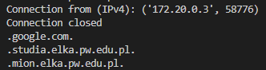

# Laboratorium 2
## Zespół: Z43
- Maciej Kozłowski - lider
- Adam Jeż
- Jakub Stacherski
- Michał Satała

## 2.1
Klient napisany w C przesyła do serwera, napisanego w Pythonie, drzewo binarne, którego węzły zawierają napisy zmiennej długości. Struktura węzła drzewa wygląda następująco:
```c
struct Node {
    struct Node *child_left;
    struct Node *child_right;
    char *text;
};
```
Funkcja `get_tree_example()` zwraca korzeń przykładowego drzewa, które następnie jest "spłaszczane", zapisywane do bufora i wysyłane do serwera. Serwer odbudowuje otrzymane drzewo używając następującej struktury reprezentującej węzeł:

```python
class Node:
    def __init__(self, text) -> None:
        self.child_left = None
        self.child_right = None
        self.text = text
```

W celu weryfikacji poprawności działania, zarówno klient jak i serwer wypisują wszystkie ścieżki od korzenia do wszystkich liści. Każda ścieżka wypisywana jest w nowej linii. Przykładowe dane imitują strukturę serwera DNS:
```
.google.com.               \
.studia.elka.pw.edu.pl.     } Oznacza, że drzewo zawiera 3 liście
.mion.elka.pw.edu.pl.      /
```

## 2.2

Stworzyliśmy sieć która akceptuje połączenia ipv4 i ipv6:

```command
docker network create --ipv6 --subnet=fd00:1::/64 --subnet=172.20.0.0/16 psi_v6
```

Zmodyfikowaliśmy kod serwera z punktu 2.1, aby przyjmował połączenia ipv4 i ipv6.

Serwer przyjmuje połączenie ipv4:



Serwer przyjmuje połączenie ipv6:


## 2.3

Do obsługi wielu klientów na raz w podwątkach wykorzystaliśmy ThreadPoolExecutor z 5-cioma workerami.

Poprawność działania serwera można przetestować np. poprzez uruchomienie 10-ciu instancji programu klienta:
```command
for i in `seq 1 10`; do ./tcp_client $HOSTNAME 8000 & done
```

